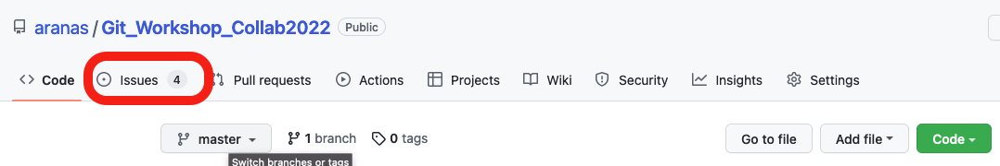

# Exercise 3: Collaborating in small teams

In these two exercises you will work with your team to solve a common task. The idea is that you get familiar with a collaborative workflow, which includes:

2) Creating issues to distribute work within a team
3) Pulling your colleagues changes
4) (optional) Creating a new branch
5) Solving merge conflicts
6) Pushing your changes to the remote
7) (optional) Create pull request for feedback on your branch
8) close the issue

## Warm-up: First push & merge conflict

Let's warm up by jumping right into our first beautiful merge chaos! In preparation for the workshop you should have cloned our workshop repo https://github.com/aranas/Git_Workshop_Collab2022.
Now you will make your first push to this shared remote repo. As you will be working on the same files with multiple people things will become messy and chaotic. Don't panic - it is just a practice repository you will be messing up, no hard consequences.


### 1) Claim an issue

Have a look at the prepared issues in our repository. To make it slightly less overwhelming, we will work in small groups.  Assign yourself to one of the issues that has fewer than 5 people working on it.



You can think of issues like a task on a to-do list. With issues you can structure your collaborative project on GitHub by specifying what needs to be done. People can assign themselves to these tasks and comment on them for example to report their progress or discuss questions with the team.

### 2) Switch to a branch
Per default every Git repository only has one branch, called main. You can check the list of available branches and which branch you are currently working from:

```console
>> git branch -a
```

As you will see, I have already created separated branches for each of your teams to work within.

Switch to your teams branch now using the command ```git checkout <name-of-branch>```. If you then run ```git branch -a``` again you will see your new branch appear in the list.

```console
>> git checkout my-team-branch
Switched to branch 'my-team-branch'
>> git branch

* my-team-branch
```

:memo: **Note**
You can create new branches using the command ```git branch <name-of-branch>```. Try to give your branches descriptive names, that will make your history more readable! Instead of using two commands to create and switch to a branch, you can also use the shortcut ```git checkout -b <name-of-branch>```, it will achieve the same. If you create a branch locally, the first time you push to it, you need to create a parallel branch on the remote repository that tracks your local branch. You can do so by typing ```git push -u origin <name-of-branch>```


### 3) Submit your changes
You have all the basic knowledge now to complete the issue. Time to get working:
- Pull recent changes (in case one of your team members has gotten ahead of you).
- Add your line to the file you have been assigned to.
- Git add <your file>
- Git commit -m "<your commit message>"

:memo: **Note**

When you commit a change that is related to an issue, you can mention the issue in your commit message as ```#xxx```. The commit will then be listed under the respective issue. If you write ```fix #xxx``` the issue will automatically be closed.

- Try to push your changes to the remote branch ```git push origin my-branch```
- You might run into a merge conflict!

### 4) Resolve any merge conflicts

Generally it is good practice to always run ```git pull``` BEFORE you start making your own changes, this way you will be applying your own changes to the up-to-date files and no conflicts should occur. However, it can happen that someone pushes their changes while you are working on your own. If this is the case Git will ask you to pull remote changes before pushing your own.

```console
>> git push origin main
To https://github.com/aranas/my_first_remote.git
 ! [rejected]        main -> main (fetch first)
error: failed to push some refs to 'https://github.com/aranas/my_first_remote.git'
hint: Updates were rejected because the remote contains work that you do
hint: not have locally. This is usually caused by another repository pushing
hint: to the same ref. You may want to first integrate the remote changes
hint: (e.g., 'git pull ...') before pushing again.
hint: See the 'Note about fast-forwards' in 'git push --help' for details.
```

In the process of pulling changes, Git will merge any changes from the remote with your own and if there is a conflict it will stop and show you the following message:

```console
>> git pull origin main
From https://github.com/aranas/my_first_remote
* branch            main     -> FETCH_HEAD
Auto-merging John_Doe.md
CONFLICT (content): Merge conflict in John_Doe.md
Automatic merge failed; fix conflicts and then commit the result.
```

Merge conflicts occur when competing changes are made to the same (or an adjacent) line of a file, or when one person edits a file and another person deletes the same file. Conflicts are standard business when working collaboratively via GitHub and you need to learn how to deal with them.
If you check ```git status``` you will see that the conflicting file is listed as modified. The basic procedure for those files is to:

#### Edit files to fix conflict  

Open your favorite text editor and navigate to the file that has merge conflicts.
To see the beginning of the merge conflict in your file, search the file for the conflict marker <<<<<<<. When you open the file in your text editor, you'll see the changes from the HEAD or base branch after the line  ```<<<<<<< HEAD ```. Next, you'll see  ```======= ```, which divides your changes from the changes in the other branch, followed by  ```>>>>>>> BRANCH-NAME ```.   

Decide if you want to keep only your branch's changes, keep only the other branch's changes, or make a brand new change, which may incorporate changes from both branches. Delete the conflict markers and make the changes you want in the final merge.

#### Resolve merge

You can use ```git add .``` to automatically add all tracked files. Before you use this option, make sure to  double check with ```git status``` that there are no tracked files that you don't want to add yet.

```console
>> git add .
```

```console
>> git commit -m "Resolved merge conflict by incorporating both suggestions."
```

At this point all conflicts are resolved and you can continue to make changes and add them to your commit or directly push to a remote.


### [Optional] Merge team branch

When you are completely satisfied with the work you have done on your new branch and you would like to bring those changes to the  branch, then one of your team memebers can merge the branch into main. For this you first checkout to the branch that should receive the changes, e.g. main. Before merging it is good practice to make sure main is up-to-date by doing a ```git pull```.


```console
>> git checkout main
Switched to branch 'main'
>> git pull origin main
From https://github.com/aranas/my_first_remote
 * branch            main     -> FETCH_HEAD
Already up to date.
```

Finally, you can merge your new branch into main:

```console
>> git merge my-branch
Updating 383bce8..c35d762
Fast-forward
 newfile.txt | 1 +
 1 file changed, 1 insertion(+)
 create mode 100644 newfile.txt
```

All other team members should pull those changes now.

## Forks

Once you are familiar with the steps above you can try out what the collaborative workflow looks like if you are **not** a contributor of a project. For example if you would like to improve code of a public project, you will usually not be allowed to directly push your changes. Instead you will need to [fork & request a pull](https://github.com/susam/gitpr) from the main developers.
